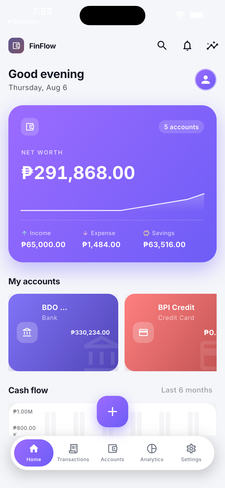
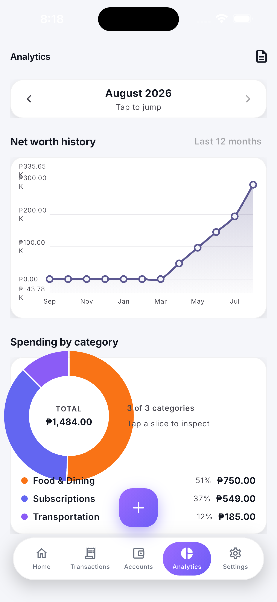
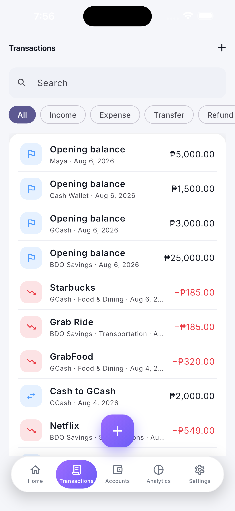
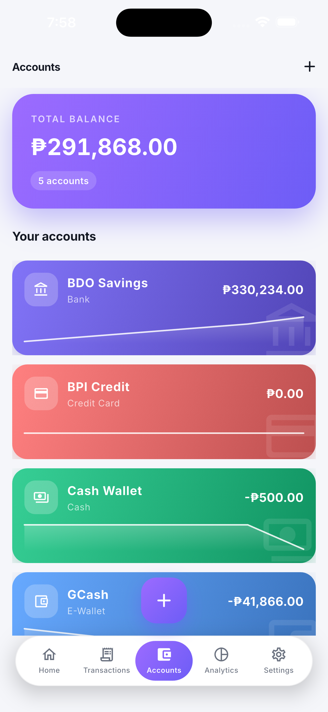

# FinFlow

**Know Where Every Peso Goes** — a local-first, offline-first personal finance platform for Android, iOS, iPadOS and the Web.

> Built on a **double-entry accounting engine**: every transaction is recorded as balanced debits and credits, so balances are always derived from the ledger and can never drift out of sync.

---

## Screenshots

<p align="center">
  
  
  
  
</p>

*Captured from the iOS simulator (iPhone 6.7″) with demo data. iPad 12.9″ versions of each screen live in [`dist/screenshots/`](dist/screenshots/).*

---

## Status

**Phases 1–11 and 13–15 complete.** Phase 12 (AI insights) is deferred — it needs a provider key. Cloud sync is live as a self-hosted, opt-in service (NestJS + Postgres + MinIO); the app stays 100% local by default.

| Phase | Deliverable | Status |
|-------|-------------|--------|
| 1 | Project setup, clean architecture, DI (Riverpod), routing (go_router) | ✅ |
| 2 | Material 3 design system — light/dark themes, tokens, reusable components | ✅ |
| 3 | Drift (SQLite) local database + double-entry ledger schema, engine, repositories | ✅ |
| 4 | Account management: detail page, edit, archive, delete (guarded), per-account activity | ✅ |
| 5 | Transaction engine UI: expense/income/transfer/refund entry, full list with search & filters | ✅ |
| 6 | Dashboard & analytics: category spend (donut + ranked list), net worth history, analytics page with month picker | ✅ |
| 7 | Budgets & goals: monthly per-category budgets with ledger-derived progress, budgets page + dashboard overview | ✅ |
| 8 | Bills & reminders: recurring bills with due-day tracking, one-tap "mark paid", dashboard due card | ✅ |
| 9 | Reports & exports: month reports with CSV + PDF export | ✅ |
| 10 | Backup & restore: portable full-database JSON snapshot (web + native) | ✅ |
| 11 | Security: 4–8 digit PIN lock, biometric unlock (native), auto-lock | ✅ |
| 12 | AI insights | ⏳ deferred (needs a provider key) |
| 13 | Optional cloud sync — self-hosted op-log sync (NestJS + Postgres + MinIO), encrypted backups | ✅ |
| 14 | Performance: windowed/paginated transaction list + 50k-row stress harness | ✅ |
| 15 | Release hardening: analyzer clean, 250 tests, web release build | ✅ |

Validation: `flutter analyze` clean · **250 Flutter tests passing** (unit + repository + widget + stress) · web release build compiles · **40 server unit + 88 e2e tests** (real Postgres + MinIO).

---

## Quick start

```bash
# Requires Flutter 3.44+ (installed at ~/flutter on this machine)
export PATH="$HOME/flutter/bin:$PATH"
flutter pub get
dart run build_runner build          # generates Drift code
flutter run                          # Android / iOS / desktop
flutter run -d chrome                # or web
flutter test                         # run the test suite
flutter analyze                      # lint
```

### Web build

The web target ships a SQLite WASM build (`web/sqlite3.wasm` + `web/drift_worker.js`) so the database runs fully in the browser with File System API persistence. Build with `flutter build web` and serve the `build/web` directory.

### Release artifacts

Android APK (`dist/FinFlow-v0.1.0.apk`), macOS DMG, the **signed iOS IPA** (`dist/FinFlow-signed.ipa` — development-signed for devices registered to team `25FHU3ZF38`) and the unsigned iOS build are covered in [`docs/BUILDING.md`](docs/BUILDING.md). All are attached to the [v0.1.0 GitHub release](https://github.com/ajcabando/FinFlow/releases/tag/v0.1.0). The Android toolchain is installed on this machine; macOS/iOS need Xcode (install steps in the guide).

---

## Architecture

```
lib/
├── main.dart                     # entry point
├── app/                          # composition root
│   ├── app.dart                  # MaterialApp.router + themes
│   ├── router/app_router.dart    # go_router navigation tree
│   └── providers/                # Riverpod: DB, repositories, theme, currency
├── core/                         # cross-cutting concerns
│   ├── constants/  errors/  utils/  extensions/  theme/
├── database/                     # Drift: tables, DAOs, seeder, connection
├── shared/widgets/               # design-system components
└── features/                     # feature-first modules
    ├── accounts/                 # domain / data / presentation
    ├── transactions/             # domain / data (UI in a later phase)
    ├── dashboard/  settings/
```

Dependency flow: **presentation → domain ← data → database → core**. Business rules
live in pure-Dart domain classes (the double-entry engine has zero Flutter or
database imports); repositories are the single write path and enforce atomicity.

See [`docs/architecture.md`](docs/architecture.md) and [`docs/database.md`](docs/database.md).

---

## The accounting engine

Every transaction produces **balanced ledger entries** (sum of debits = sum of credits):

| Event | Debit | Credit |
|---|---|---|
| Expense (₱500 cash) | Food & Dining 500 | Cash 500 |
| Income (₱30,000 salary) | Bank 30,000 | Salary 30,000 |
| Cash → GCash transfer ₱1,000 | GCash 1,000 | Cash 1,000 |
| Credit card purchase ₱2,000 | Groceries 2,000 | Credit Card 2,000 |
| Credit card payment ₱2,000 | Credit Card 2,000 | Bank 2,000 |
| Account opening ₱5,000 | Account 5,000 | Opening Balances 5,000 |

Balances are **derived, never stored**: debit-normal accounts (cash, bank, expense
categories) = debits − credits; credit-normal accounts (credit cards, income
categories) = credits − debits. Because the ledger is the only source of truth,
balance corruption is structurally impossible — and transfers & credit cards can
never be double-counted.

---

## What works today

- **Dashboard** — animated Net Worth hero (assets − liabilities), quick actions, monthly cash flow chart, current-month spending by category, recent activity feed with "View all".
- **Analytics** — dedicated page with a month picker: 12-month net worth history line chart, spending & income breakdowns by category (tappable donut charts with ranked lists).
- **Budgets** — monthly limit per expense category with progress tracked straight from the ledger (refunds included); budgets page with month picker, budgeted/spent/left summary, over-budget highlighting, plus a dashboard overview with the top at-risk budgets.
- **Transactions** — add expense / income / transfer / refund with date & time pickers, accounts, categories, merchant and notes; full transaction list with instant search and type filters.
- **Accounts** — create (cash, bank, debit/credit card, e-wallet, PayPal, crypto, investment, loan) with opening balances recorded as balanced ledger transactions; detail page with balance, info, per-account activity, edit / archive / delete (guarded).
- **Bills & reminders** — recurring bills (rent, subscriptions…) with due-day tracking, "due soon / overdue / paid" states, one-tap mark-paid, and a dashboard card for what needs attention.
- **Reports** — month reports with income/expense/net summary, category breakdown and the full transaction list, exportable as CSV or a styled PDF statement.
- **Backup & restore** — export the entire database (accounts, transactions, ledger, budgets, bills, settings) as one portable JSON file and restore it later; works identically on web and native.
- **Security** — optional 4–8 digit PIN lock (salted SHA-256, never stored in plaintext), Touch ID / Face ID unlock on native, auto-lock on background, and a lock-now action.
- **Profile** — set your name and photo (Settings → top card, or tap the dashboard avatar); the dashboard greets you by first name ("Good morning, Alain"). Photos are compressed into a small data URI stored in app settings, so your profile syncs across devices when cloud sync is on.
- **Self-hosted sync (opt-in)** — email/password accounts against your own server (NestJS + Postgres + MinIO, set via `FINFLOW_API_URL`): operation-log sync with conflict resolution (CAS + last-write-wins), device registry with per-device revoke, and zero-knowledge cloud backups — client-encrypted (AES-256-GCM + PBKDF2) with a configurable schedule. Off by default; without the define the app is fully local. See `docs/SELF_HOSTED.md` and `docs/BACKEND_API.md`.
- **Settings** — profile (name + photo), theme (system/light/dark, persisted), default currency, category manager, security, backup, and a version/update checker in About.
- **Update checking** — Settings → About shows the real installed version (from package_info) and can check the public GitHub releases feed for a newer build ("Check for updates"), surfacing an in-app dialog with the release's "What's new" notes that opens the release page. A silent launch-time check pre-advertises an available update on the About card.
- **Performance** — the transaction list loads in fixed windows with database-level search and type filters, so 50k+ histories stay responsive (covered by a stress harness).
- **Data model ready** — transactions, ledger, tags, attachments, settings, budgets and bills tables with the full double-entry plumbing (validation, atomic writes, reactive streams, semantic type rules).

## Roadmap (from the master plan)

- **8. Bills & reminders** — ✅ recurring bills with due-day tracking and mark-paid
- **9. Reports & exports** — ✅ month reports + CSV/PDF export
- **10. Backup & restore** — ✅ portable JSON snapshot
- **11. Security** — ✅ PIN + biometrics (device-level at-rest encryption remains a future hardening item)
- **12. AI insights** — ⏳ next: rule-based insights first, then an AI provider once a key is available
- **13. Optional cloud sync** — ✅ self-hosted op-log sync (NestJS + Postgres + MinIO): email/password auth, operation-log push/pull with CAS + LWW conflict resolution, device registry, encrypted cloud backups. Offline-first: the local DB is authoritative; sync is opt-in via `FINFLOW_API_URL` (see `docs/SELF_HOSTED.md`)
- **14. Performance** — ✅ windowed list + 50k stress harness
- **15. Release hardening** — ✅ analyzer clean, 250 tests, web release build
